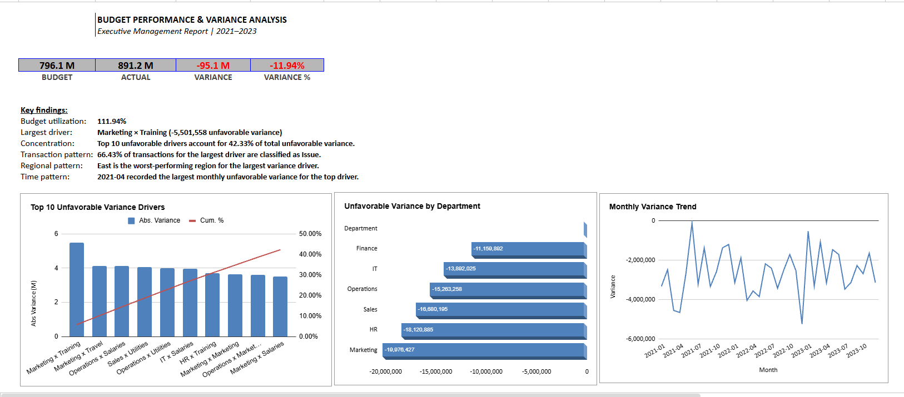

# Budget Performance & Variance Analysis

This project started as a Budget vs Actual analysis in Google Sheets and was later extended to BigQuery and Python.

The main goal was to understand the overall budget overrun and identify which departments, cost categories, regions and periods were driving the unfavorable variance.



## What I analyzed

The analysis focused on:

- overall Budget vs Actual performance
- unfavorable variance by Department and Category
- Top 10 variance drivers and their cumulative contribution
- regional and monthly patterns behind the largest drivers
- transaction-level exceptions
- validation of the main results across Google Sheets, BigQuery and Python

## Key findings

- Total Budget: **796.1M**
- Total Actual: **891.2M**
- Unfavorable Variance: **95.1M (-11.94%)**
- The largest individual driver was **Marketing × Training**, with an unfavorable variance of **5.50M**
- The Top 10 drivers accounted for **42.33%** of total unfavorable variance
- **East** was the worst-performing region for the largest driver
- **April 2021** was the worst month for the largest driver
- **66.43%** of transactions within the largest driver were classified as unfavorable

The results suggest that the overall budget overrun was relatively distributed rather than being caused by only a few isolated cost drivers.

## Tools

**Google Sheets**  
Used for data preparation, exploratory analysis, root cause analysis and the executive management report.

**BigQuery SQL**  
Used to recreate the transformation and analytical logic, perform data quality checks, rank variance drivers and validate the results from the original analysis.

**Python / Google Colab**  
Used to retrieve analytical outputs from BigQuery, validate key KPIs, create visualizations and automatically generate a management summary.

## SQL analysis

The SQL part of the project follows a simple analytical flow:

```text
Raw data
   ↓
Staging
   ↓
Data quality checks
   ↓
Executive KPIs
   ↓
Department × Category analysis
   ↓
Pareto analysis
   ↓
Regional / Monthly drill-down
   ↓
Transaction analysis
   ↓
Reconciliation
```

The SQL scripts can be found in the [`sql`](sql/) folder.

## Python automation

The Python notebook connects to the BigQuery analytical layer and:

- extracts KPI, driver and Pareto results
- validates the main financial metrics
- identifies the largest variance driver
- generates analytical visualizations
- creates a data-driven management summary
- exports selected analytical outputs

Notebook: [`budget_variance_automation.ipynb`](python/budget_variance_automation.ipynb)

## Repository structure

```text
budget-variance-analysis/
├── sql/
├── python/
│   └── budget_variance_automation.ipynb
├── output/
│   ├── driver_summary.csv
│   └── management_summary.txt
├── screenshots/
│   └── executive_report.PNG
└── README.md
```

## Data source

The analysis is based on a public Budget vs Actual dataset from Kaggle.

The original dataset is not included in this repository.
